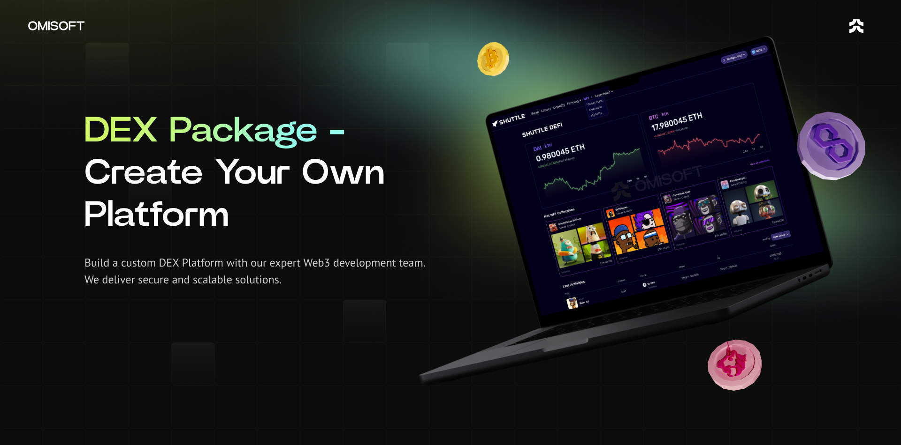

# Blockchain DEX Platform | Case Study & Custom dApp Solution

The **Blockchain DEX Platform** provides a foundation for launching your own decentralized exchange or trading platform. This repository demonstrates how our white-label solution can help you quickly enter the Web3 market while saving on development costs.

**Interested in launching your DEX?** We handle the technical implementation so you can focus on marketing and community growth.

## Why Choose This Solution?

Our white-label DEX Platform accelerates your time to market by offering ready-made functionality with customization options to suit your business needs. Avoid the high costs and complexity of building from scratch.

## Features Included in the Solution

### Core Functionality

- **Wallet Integration**: Supports Trust Wallet, Wallet Connect, and Coinbase Wallet.  
- **Multichain Support**: Operates across Ethereum and other networks.  
- **Swap & Liquidity Pools**: Built-in trading and liquidity management.  
- **Launchpad & NFT Marketplace**: Support for token launches and NFT transactions.  
- **Mobile Optimization**: Seamless experience on mobile devices.  
- **Admin Panel**: Manage system settings with ease.  
- **Figma Design File**: Editable design assets for customization.  
- **Localization**: Multilingual support for global audiences.  
- **DDoS Protection**: Robust security against cyber threats.  
- **CI/CD Pipelines**: Automates deployment and scaling.  
- **Marketing Tools**: Includes Google Analytics and Microsoft Clarity for insights.

### Additional Features on Request

- Farming and Staking  
- Wallet Extensions (e.g., Chrome)  
- Landing Pages and Blogs  
- Social Media Integration  
- Mobile Applications  
- Telegram Bots or Mini Apps  
- Lotteries and Loot Boxes  
- Referral Systems and More  

## Technology Overview

We use a modern, scalable tech stack to ensure your DEX operates smoothly and securely.

  
Front End (App & Admin Panel)

  <ul>
      <li>React.js</li>
      <li>Redux Toolkit</li>
      <li>TypeScript</li>
      <li>Wagmi</li>
      <li>Jest (Unit Testing)</li>
  </ul>

  
Back End

  <ul>
      <li>Node.js</li>
      <li>Express.js</li>
      <li>TypeScript</li>
      <li>MongoDB & Mongoose</li>
      <li>Swagger (API Documentation)</li>
      <li>Jest & Supertest (Testing)</li>
  </ul>

  
Blockchain

  <ul>
      <li>Solidity (Smart Contracts for Swap, Liquidity Pools, etc.)</li>
  </ul>

  
DevOps

  <ul>
      <li>Docker</li>
      <li>GitLab CI</li>
  </ul>

## Pricing Packages

|                  | Basic Package | NoFee Package  | Special Offer |
|------------------|---------------|----------------|---------------|
| Revenue Share    | 0.5%          | 0%             | 0%            |
| Maintenance Cost | Free          | $2,000/month   | Free          |
| Community Size   | 1,000+        | 10,000+        | 50,000+       |
| Custom Design    | Colors Only   | Fully Custom   | Fully Custom  |
| Initial Cost     | $15,000       | $50,000        | Contact Us    |

## Request a Demo

Get a live demo of the DEX Platform and learn how we can customize it to meet your needs.

- <a href="https://telegram.me/omisoft" target="_blank">Message Us on Telegram</a>  
- <a href="https://omisoft.net/contact-us?utm_campaign=web3-dex-platform&utm_medium=social&utm_source=github" target="_blank">Visit Our Website</a>  
- [Email Us Directly](mailto:hi@omisoft.net)  

## Supported Networks

Our DEX Platform supports a wide range of networks, including:  

- Ethereum, Arbitrum, Optimism, Polygon, Base, BNB Chain, Avalanche, Celo, Polkadot, and more.  
- Need a custom network? Contact us to discuss integration.

## Frequently Asked Questions

  
Why choose a white-label DEX solution?

  
Our solution saves you significant time and cost compared to building a DEX from scratch. It offers flexibility and scalability, making it suitable for both startups and established businesses.

  
How long does it take to launch?

  
With our white-label solution, you can launch in less than a month—3-4 times faster than traditional development. Additional features can be developed separately if needed.

  
What features are included in the packages?

  
The Basic and NoFee packages differ by revenue share, maintenance costs, and customization level. Contact us for more details about our Special Offer tailored for large communities.

  
Can the product be hosted on our servers?

  
Yes, we provide CI/CD pipelines for seamless updates and deployments on your infrastructure.

## Next Steps

Ready to build your own DEX Platform? Contact us today to get started.  

Explore similar solutions:  

- [NotCoin Like Game](https://omisoft.net/demo/notcoin-script)  
- [Crypto Lottery](https://omisoft.net/demo/crypto-lottery)  
- [ICO & IDO Launchpad](https://omisoft.net/demo/white-label-crypto-launchpad-development)  
